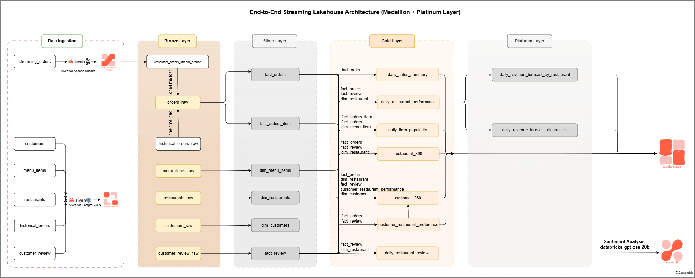
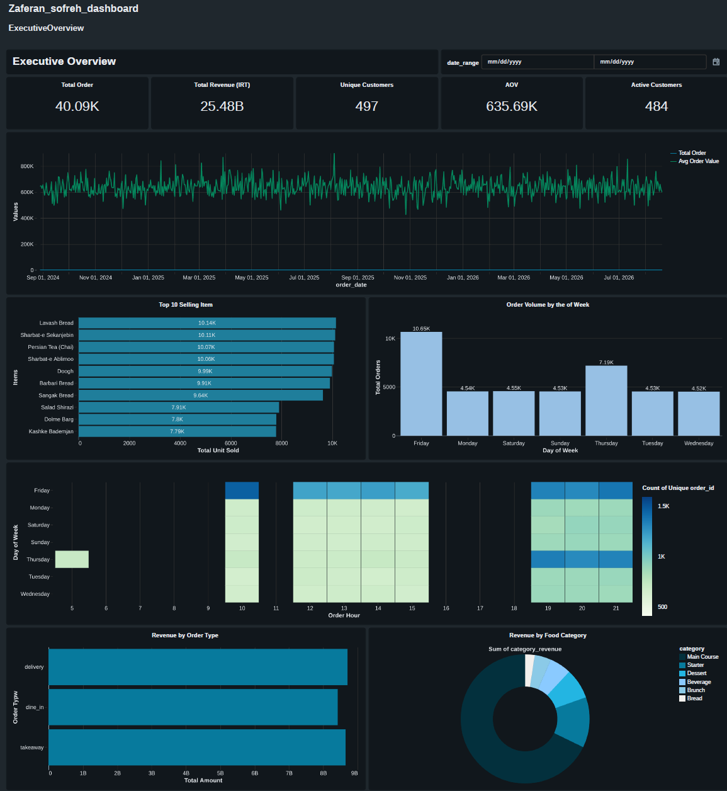
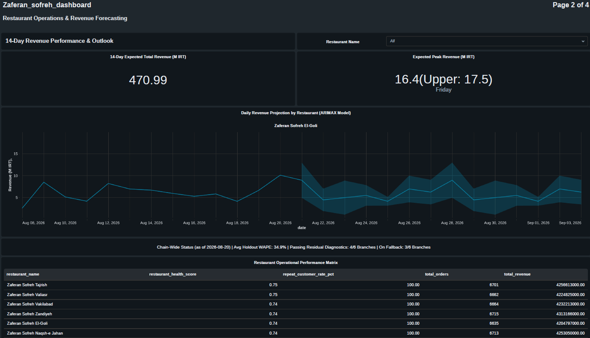
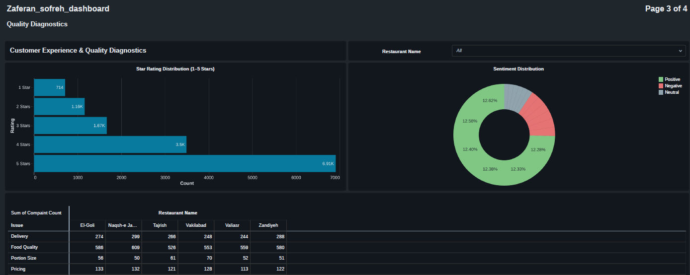

# Zaferan Sofreh — Restaurant Intelligence & Forecasting Platform

A production-style lakehouse that ingests transactional and streaming data from a Persian-restaurant chain, processes it through a medallion (Bronze → Silver → Gold → **Platinum**) architecture on Databricks, and layers rigorous statistical and time-series modeling on top — not just dashboards, but estimated, validated, and diagnosed models behind every number.

---

## At a Glance

- **Dual-path ingestion**: batch reference/historical data from Aiven PostgreSQL (JDBC) + live order events from Aiven Kafka (Structured Streaming, SASL_SSL/SCRAM-SHA-256), unified and deduplicated into a single Silver source of truth.
- **LLM-powered unstructured data**: free-text customer reviews converted into structured sentiment + 4-category issue classification via Databricks SQL `ai_query()`, governed by declarative data-quality constraints.
- **Per-restaurant demand forecasting at scale**: one ARIMAX model per restaurant, fit in parallel across Spark workers via `applyInPandas`, with AICc-based order selection, log1p-transformed (naturally non-negative) prediction intervals, WAPE-based holdout validation, and an automated fallback to a transparent seasonal-median baseline when a model doesn't meet its own diagnostic bar.
- **Deployed as code**: a Databricks Asset Bundle (`databricks.yml`) defines the Lakeflow pipeline and a scheduled job — not hand-wired notebooks — with a CI workflow that lints and validates the bundle on every push.
- **A real debugging trail, documented**: several non-obvious production bugs (silent type coercion, a streaming-over-overwrite duplication bug, a dashboard metric that always read zero) were found through systematic validation rather than left undiscovered — see [§16](#16-engineering-rigor-issues-found--fixed).

---

## Table of Contents

1. [Problem Statement](#1-problem-statement)
2. [Solution Overview](#2-solution-overview)
3. [Why This Approach — Key Benefits](#3-why-this-approach--key-benefits)
4. [Architecture](#4-architecture)
5. [Tech Stack](#5-tech-stack)
6. [Repository Structure](#6-repository-structure)
7. [Prerequisites](#7-prerequisites)
8. [Setup Guide](#8-setup-guide)
9. [Running the Pipeline End-to-End](#9-running-the-pipeline-end-to-end)
10. [LLM-Powered Review Intelligence](#10-llm-powered-review-intelligence)
11. [Data Quality Framework](#11-data-quality-framework)
12. [Gold Layer Data Dictionary](#12-gold-layer-data-dictionary)
13. [Platinum Layer — Statistical & ML Modeling](#13-platinum-layer--statistical--ml-modeling)
14. [Dashboards](#14-dashboards)
15. [Dashboard Screenshots](#15-architecture-diagram--dashboard-screenshots)


---

## 1. Problem Statement

A multi-branch restaurant chain needs a unified view of its business that combines three data sources with very different characteristics:

- **Historical, batch-loaded reference and transactional data** (restaurants, customers, menu items, historical orders, reviews) sitting in an operational PostgreSQL database.
- **Live order events** arriving continuously as a Kafka stream, which must be captured with low latency and without data loss.
- **Unstructured customer reviews** (free text), which carry rich signal about food quality, delivery experience, pricing perception, and portion size — but this signal is not queryable in raw text form.

Without a governed, layered data platform, these sources remain siloed: operational teams cannot answer questions such as "which restaurants are trending down in customer satisfaction," "which branch will be busy next Friday, and how confident are we," or "which menu items are underperforming" without manual, error-prone, one-off analysis.

## 2. Solution Overview

This project implements a **medallion architecture (Bronze / Silver / Gold / Platinum)** on **Databricks**, fed by two independent producers on **Aiven** (managed PostgreSQL and managed Kafka), and orchestrated using **Databricks Lakeflow Declarative Pipelines**. The platform:

- Ingests **batch reference and historical data** from Aiven PostgreSQL via JDBC into Bronze Delta tables.
- Ingests **streaming order events** from Aiven Kafka into a Bronze streaming Delta table, with checkpointing and schema parsing handled declaratively.
- Conforms and deduplicates historical + streaming orders into a single **Silver** source of truth (`orders_unified_silver`).
- Builds **Silver fact and dimension tables** with declarative data-quality expectations.
- Uses an **LLM (`databricks-gpt-oss-20b`) via `ai_query()`** to convert unstructured review text into structured sentiment and issue classifications.
- Aggregates everything into **Gold-layer marts**: daily sales summaries, restaurant review rollups, a statistically-derived preference score, `customer_360`, `restaurant_360`, item popularity, and daily restaurant performance.
- Adds a **Platinum layer** of estimated statistical models on top of Gold: per-restaurant ARIMAX revenue forecasting with full diagnostics — see [§13](#13-platinum-layer--statistical--ml-modeling).

## 3. Why This Approach — Key Benefits

| Benefit | How it's achieved |
|---|---|
| **Single source of truth** | Historical and live orders are conformed into one deduplicated Silver table, so downstream consumers never reconcile two order feeds. |
| **Low-latency insight into live operations** | Kafka streaming ingestion + Lakeflow streaming tables mean new orders flow into Bronze/Silver/Gold without a nightly batch window. |
| **Trustworthy data** | Every Silver/Gold table declares explicit data-quality expectations so malformed records are caught and dropped at the layer boundary, not silently propagated. |
| **Unstructured data made analytical** | Free-text reviews become structured, filterable fields via an LLM prompt with a strictly enforced JSON contract. |
| **Statistically defensible, not hand-tuned** | Forecast intervals and model selection are all *estimated from the data* (AICc order selection, Ljung-Box diagnostics, skill-vs-naive-benchmark scoring) rather than asserted as constants — see [§13](#13-platinum-layer--statistical--ml-modeling). |
| **Forecasts that know when to distrust themselves** | Each restaurant's forecast carries its own diagnostics (residual white-noise test, holdout WAPE) and automatically falls back to a transparent baseline if it fails either — see [§13](#13-platinum-layer--statistical--ml-modeling). |
| **Governed, secure storage** | Unity Catalog with managed Volumes for the Kafka CA certificate and CSV landing zone — no path-based DBFS access, no hardcoded credentials. |
| **Deployed as code** | A Databricks Asset Bundle defines the pipeline and job resources; CI validates the bundle on every push — see [§8.6](#86-deploy-via-databricks-asset-bundle). |
| **Business-ready outputs** | Gold and Platinum tables are pre-aggregated and dashboard-ready, minimizing the modeling burden on BI tools. |

## 4. Architecture

*[Architecture](#architecture).*



## 5. Tech Stack

| Layer | Technology |
|---|---|
| Operational database | Aiven for PostgreSQL |
| Event streaming | Aiven for Apache Kafka (SASL_SSL / SCRAM-SHA-256) |
| Lakehouse platform | Databricks (Unity Catalog, Lakeflow Declarative Pipelines) |
| Storage format | Delta Lake |
| Processing | PySpark (Structured Streaming + batch), Spark SQL, Pandas UDFs (`applyInPandas`) |
| Unstructured data enrichment | Databricks SQL `ai_query()` → `databricks-gpt-oss-20b` |
| Statistical / ML modeling | `statsmodels` (SARIMAX, ADF, Ljung-Box), NumPy — see [§13](#13-platinum-layer--statistical--ml-modeling) |
| Ingestion / scripting | Python (`sqlalchemy`, `pandas`, `kafka-python`, `pydantic`, `python-dotenv`) |
| Secrets management | Databricks Secret Scopes |
| Deployment | Databricks Asset Bundles (`databricks.yml`) |
| CI | GitHub Actions (lint + `databricks bundle validate`) |
| BI | Databricks Lakeview Dashboards |

## 6. Repository Structure

```
databricks.yml                                    # Databricks Asset Bundle root config
resources/
└── zaferan_sofreh_pipeline.yml                    # Lakeflow pipeline + scheduled job resource
requirements.txt                                    # Python deps (ingestion + statsmodels/lifelines/scikit-learn)
.env.example
.gitignore
.github/workflows/ci.yml                            # Lint + bundle-validate on push/PR

dashboards/
└── revenue_outlook_queries.sql                      # Version-controlled Lakeview dashboard SQL

src/
├── ingestion/
│   └── aiven_postgres_leader.py
├── streaming/
│   └── aiven_kafka_producer.py
generators/                                          # Synthetic data generation (reproducible, seeded)
├── reference_data.py
├── historical_orders.py
└── reviews.py

databricks/
├── 00_setup/
│   └── create_catalog_and_schemas.sql
├── 01_ingestion/
│   ├── 01_load_reference_tables_from_aiven.py       # Bronze: batch JDBC load
│   └── 02_stream_orders_from_aiven.py               # Bronze: streaming load from Kafka
├── 02_transformation/
│   ├── 01_build_orders_unified_silver.py
│   ├── 02_fact_orders.py
│   ├── 03_fact_orders_item.py
│   ├── 04_fact_review.sql                           # LLM sentiment/issue classification
│   ├── 05_dim_restaurant.py
│   ├── 06_dim_customer.py
│   └── 07_dim_menu_item.py
├── 03_marts/
│   ├── 01_daily_sales_summery.py
│   ├── 02_daily_restaurant_reviews.py
│   ├── 03_customer_restaurant_preference.py
│   ├── 04_customer_360.py
│   ├── 05_restaurant_360.py
│   ├── 06_daily_item_popularity.py
│   └── 07_daily_restaurant_performance.py           # Panel-model-ready: calendar + restaurant context
└── 04_analytics/
    ├── 01_sarima_revenue_forecast.py                # Per-restaurant ARIMAX forecasting (see §13)
    └── README.md                                    # Full method documentation for the forecasting approach
```

## 7. Prerequisites

- An **Aiven** account with permission to create services.
- A **Databricks** workspace with Unity Catalog, secret-scope permissions, and access to a Foundation Model endpoint for `ai_query()`.
- Local Python 3.9+ with the packages in `requirements.txt`.

## 8. Setup Guide

### 8.1 Provision Aiven PostgreSQL
Create a PostgreSQL service in the [Aiven Console](https://console.aiven.io/); note host, port, database, user, and password from the Overview tab.

### 8.2 Provision Aiven Kafka
Create a Kafka service with SASL authentication; create the `restaurant-orders` topic; note the bootstrap servers and SASL credentials.

### 8.3 Download the Kafka CA Certificate (ca.pem)
Download `ca.pem` from the Kafka service's Overview tab and upload it to:
```
/Volumes/zaferan_sofreh/bronze/kafka_certs/ca.pem
```

### 8.4 Configure Local Credentials (.env)
Copy `.env.example` to `.env` and fill in your Aiven PostgreSQL and Kafka credentials, plus `DATA_DIR` pointing at your five source CSVs (or generate them — see [§9.0](#90-optional-generate-synthetic-data)).

### 8.5 Configure Databricks Secrets & Cluster Config
```bash
databricks secrets create-scope aiven-postgres
databricks secrets put-secret aiven-postgres host      --string-value "<your-pg-host>"
databricks secrets put-secret aiven-postgres password  --string-value "<your-pg-password>"
# ...repeat for port, db, user
```
Set `aiven.username` / `aiven.password` Spark confs on the pipeline cluster for Kafka, ideally backed by a second secret scope.

### 8.6 Deploy via Databricks Asset Bundle
```bash
databricks configure --token
databricks bundle validate -t dev
databricks bundle deploy   -t dev
```
This deploys the Lakeflow pipeline (Bronze → Silver → Gold notebooks wired in dependency order) and a scheduled job, defined declaratively in `databricks.yml` / `resources/zaferan_sofreh_pipeline.yml` — not click-ops.

### 8.7 Provision Unity Catalog
Run `databricks/00_setup/create_catalog_and_schemas.sql` to create the catalog, schemas, and Volumes.

## 9. Running the Pipeline End-to-End

### 9.0 (Optional) Generate Synthetic Data
`generators/` produces fully reproducible synthetic data (fixed random seed) for six Zaferan Sofreh branches across Iran: `reference_data.py` (restaurants, menu, customers), `historical_orders.py` (seasonality-aware historical orders — Friday/Thursday demand peaks are baked into generation, which is later independently *recovered* by the ARIMAX model with no hints given to it), and `reviews.py` (rating-conditioned review text for a subset of orders). Run via `run_pipeline.py`.

### 9.1 Seed Reference & Historical Data (Aiven Postgres)
```bash
python src/ingestion/aiven_postgres_leader.py
```

### 9.2 Stream Live Orders (Aiven Kafka)
```bash
python src/streaming/aiven_kafka_producer.py --interval 2 --max-orders 500
```

### 9.3 Bronze Layer Ingestion (Databricks)
`01_load_reference_tables_from_aiven.py` (batch JDBC) and `02_stream_orders_from_aiven.py` (Kafka streaming table).

### 9.4 Silver Layer Transformations
Orders are unified/deduplicated, exploded into fact tables with DQ expectations, and reviews are LLM-enriched (§10). **Dimension tables (`dim_restaurant`, `dim_customer`) are read as full batch, not streaming**.

### 9.5 Gold Layer Marts
Seven marts covering sales, reviews, a statistically-derived preference score, and two 360° views. See [§12](#12-gold-layer-data-dictionary) for the data dictionary.

## 10. LLM-Powered Review Intelligence

`04_fact_review.sql` calls Databricks SQL's `ai_query()` against **`databricks-gpt-oss-20b`** to turn each review into a strict JSON object: `sentiment` plus four issue categories (delivery, food quality, pricing, portion size), each with a boolean flag, a severity level, and a brief reason. Six `CONSTRAINT ... ON VIOLATION DROP ROW` checks guard against malformed LLM output before it reaches downstream consumers.

## 11. Data Quality Framework

Every Silver and several Gold tables declare **declarative expectations** enforced by the Lakeflow pipeline engine — non-null keys, positive amounts, allow-listed enums — with rows failing an expectation automatically dropped rather than silently propagated. Pipeline run metrics surface exactly how many rows were dropped per expectation on every run.

## 12. Gold Layer Data Dictionary

| Table | Grain | Key metrics |
|---|---|---|
| `daily_sales_summary` | 1 row / day | total orders, total revenue, HLL customer sketch, order-type split |
| `daily_restaurant_reviews` | 1 row / restaurant | total reviews, avg rating, star distribution, sentiment mix |
| `customer_restaurant_preference` | 1 row / customer × restaurant | order_share, recency_score, experience_score, preference_score |
| `customer_360` | 1 row / customer | lifetime spend, loyalty segment, activity status, preferred restaurant |
| `restaurant_360` | 1 row / restaurant | revenue, repeat-customer rate, complaint counts, health score |
| `daily_item_popularity` | 1 row / day × restaurant × item | order count, quantity sold, revenue |
| `daily_restaurant_performance` | 1 row / day × restaurant | orders, revenue, reviews, calendar features, restaurant context — the panel-model source table for §13 |

## 13. Platinum Layer — Statistical & ML Modeling

Full mathematical derivations for the forecasting approach live in [`databricks/04_analytics/README.md`](databricks/04_analytics/README.md) (method-level detail) and [`docs/statistical_methodology.md`](docs/statistical_methodology.md) (general framework). This section summarizes what's implemented and why.


### Per-Restaurant Revenue Forecasting (ARIMAX)

`04_analytics/01_sarima_revenue_forecast.py` fits one model **per restaurant**, in parallel across Spark workers via `groupBy().applyInPandas`:

- **Order selection**: AICc-minimizing grid search over $(p,q,P,Q,D)$ per restaurant — no restaurant is forced into another's model structure.
- **Exogenous regressors**: Thursday/Friday calendar dummies alongside `seasonal_order=(P,D,Q,7)`.
- **Log-space modeling**: fits $\log(1+\text{revenue})$, not raw revenue, so prediction intervals taper naturally toward zero instead of requiring a hard clamp on an unbounded Gaussian interval — see [§16](#16-engineering-rigor-issues-found--fixed).
- **Validation**: a 14-day holdout scored by **WAPE** (not MAPE — robust to near-zero-revenue days) and a **Ljung-Box test** on standardized residuals.
- **Automated fallback**: a restaurant's ARIMAX forecast is used only if it *both* passes residual diagnostics *and* beats a seasonal-naive ("repeat last week's actuals") benchmark on holdout WAPE — a relative bar, not a flat cutoff, since how noisy a restaurant's demand is varies restaurant to restaurant. Otherwise the pipeline falls back to a transparent 28-day day-of-week median ± 1.28·σ (matching the 80% interval used elsewhere). Every row carries a `forecast_method` (`ARIMAX` vs `SEASONAL_MEDIAN_FALLBACK`) so dashboard consumers always know which one they're looking at. Full detail: `databricks/04_analytics/README.md`.
- **Operational grounding**: forecasts are capped at 1.25× the 99th percentile of historical daily revenue — a business-judgment ceiling layered on top of the statistical model, not a substitute for it.
- **Diagnostics as a first-class output**: `daily_revenue_forecast_diagnostics` is append-only (an audit trail across every scheduled run), not overwritten — see `dashboards/revenue_outlook_queries.sql` for the "latest run only" view every dashboard/consumer should read from.

## 14. Dashboards

A Databricks Lakeview **"Revenue Outlook"** dashboard consumes the Platinum layer directly:

- A restaurant-filterable fan chart (`Historical vs. Projected Daily Revenue`) bridging actuals into the forecast with a shaded prediction band.
- Counter widgets for 14-day expected total revenue and expected peak-revenue day.
- An **adaptive diagnostics footer** — a single widget that shows per-branch model diagnostics (order, WAPE, residual test result) when one restaurant is filtered, or a chain-wide summary (avg WAPE, branches passing diagnostics, branches on the fallback) otherwise.

All dashboard SQL is version-controlled in [`dashboards/revenue_outlook_queries.sql`](dashboards/revenue_outlook_queries.sql) rather than living only inside the Lakeview UI.

## 15.Dashboard Screenshots






---

*Maintained as part of the Zaferan Sofreh restaurant analytics platform. Contributions and issue reports welcome.*